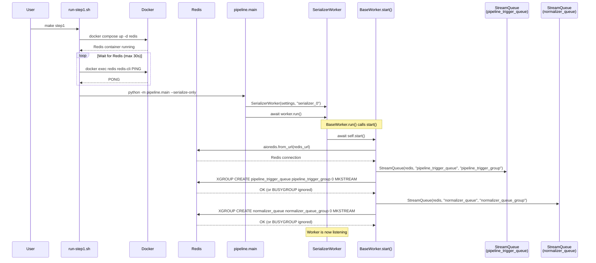
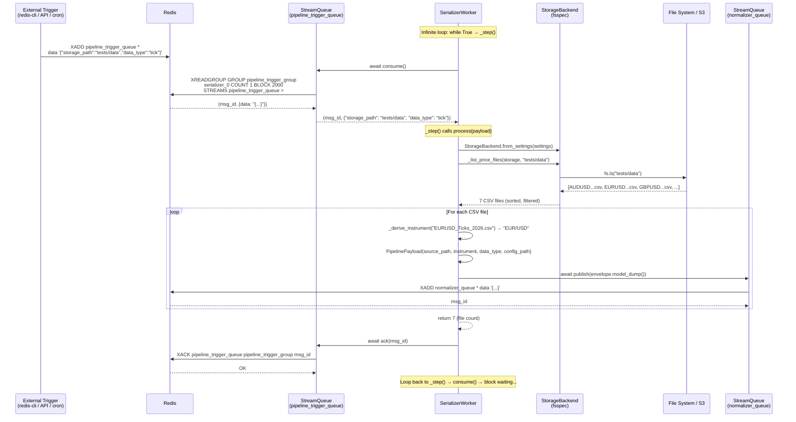
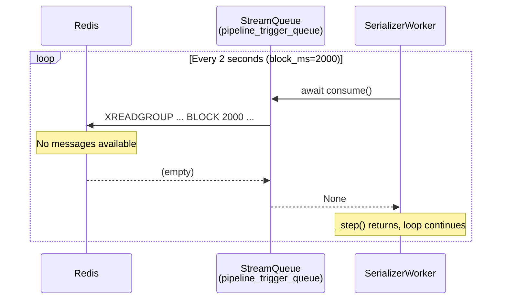

# Step 1 — Work Queue Serializer: Startup & Processing Sequence

## Startup Sequence

```mermaid
sequenceDiagram
    participant User
    participant Shell as run-step1.sh
    participant Docker
    participant Redis
    participant Main as pipeline.main
    participant Worker as SerializerWorker
    participant BaseWorker as BaseWorker.start()
    participant InputQ as StreamQueue<br/>(pipeline_trigger_queue)
    participant OutputQ as StreamQueue<br/>(normalizer_queue)

    User->>Shell: make step1
    Shell->>Docker: docker compose up -d redis
    Docker-->>Shell: Redis container running

    loop Wait for Redis (max 30s)
        Shell->>Docker: docker exec redis redis-cli PING
        Docker-->>Shell: PONG
    end

    Shell->>Main: python -m pipeline.main --serialize-only
    Main->>Worker: SerializerWorker(settings, "serializer_0")
    Main->>Worker: await worker.run()

    Note over Worker,BaseWorker: BaseWorker.run() calls start()

    Worker->>BaseWorker: await self.start()
    BaseWorker->>Redis: aioredis.from_url(redis_url)
    Redis-->>BaseWorker: Redis connection

    BaseWorker->>InputQ: StreamQueue(redis, "pipeline_trigger_queue", "pipeline_trigger_group")
    BaseWorker->>Redis: XGROUP CREATE pipeline_trigger_queue pipeline_trigger_group 0 MKSTREAM
    Redis-->>BaseWorker: OK (or BUSYGROUP ignored)

    BaseWorker->>OutputQ: StreamQueue(redis, "normalizer_queue", "normalizer_queue_group")
    BaseWorker->>Redis: XGROUP CREATE normalizer_queue normalizer_queue_group 0 MKSTREAM
    Redis-->>BaseWorker: OK (or BUSYGROUP ignored)

    Note over Worker: Worker is now listening
```

## Message Processing Loop

```mermaid
sequenceDiagram
    participant External as External Trigger<br/>(redis-cli / API / cron)
    participant Redis
    participant InputQ as StreamQueue<br/>(pipeline_trigger_queue)
    participant Worker as SerializerWorker
    participant Storage as StorageBackend<br/>(fsspec)
    participant FS as File System / S3
    participant OutputQ as StreamQueue<br/>(normalizer_queue)

    Note over Worker: Infinite loop: while True → _step()

    External->>Redis: XADD pipeline_trigger_queue *<br/>data '{"storage_path":"tests/data","data_type":"tick"}'

    Worker->>InputQ: await consume()
    InputQ->>Redis: XREADGROUP GROUP pipeline_trigger_group<br/>serializer_0 COUNT 1 BLOCK 2000<br/>STREAMS pipeline_trigger_queue >
    Redis-->>InputQ: (msg_id, {data: "{...}"})
    InputQ-->>Worker: (msg_id, {"storage_path": "tests/data", "data_type": "tick"})

    Note over Worker: _step() calls process(payload)

    Worker->>Storage: StorageBackend.from_settings(settings)
    Worker->>Storage: _list_price_files(storage, "tests/data")
    Storage->>FS: fs.ls("tests/data")
    FS-->>Storage: [AUDUSD...csv, EURUSD...csv, GBPUSD...csv, ...]
    Storage-->>Worker: 7 CSV files (sorted, filtered)

    loop For each CSV file
        Worker->>Worker: _derive_instrument("EURUSD_Ticks_2026.csv") → "EUR/USD"
        Worker->>Worker: PipelinePayload(source_path, instrument, data_type, config_path)
        Worker->>OutputQ: await publish(envelope.model_dump())
        OutputQ->>Redis: XADD normalizer_queue * data '{...}'
        Redis-->>OutputQ: msg_id
    end

    Worker-->>Worker: return 7 (file count)

    Worker->>InputQ: await ack(msg_id)
    InputQ->>Redis: XACK pipeline_trigger_queue pipeline_trigger_group msg_id
    Redis-->>InputQ: OK

    Note over Worker: Loop back to _step() → consume() → block waiting...
```

## Idle State (No Messages)

```mermaid
sequenceDiagram
    participant Redis
    participant InputQ as StreamQueue<br/>(pipeline_trigger_queue)
    participant Worker as SerializerWorker

    loop Every 2 seconds (block_ms=2000)
        Worker->>InputQ: await consume()
        InputQ->>Redis: XREADGROUP ... BLOCK 2000 ...
        Note over Redis: No messages available
        Redis-->>InputQ: (empty)
        InputQ-->>Worker: None
        Note over Worker: _step() returns, loop continues
    end
```
